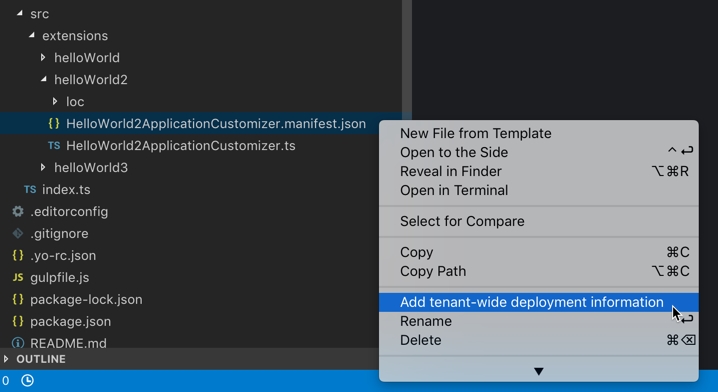
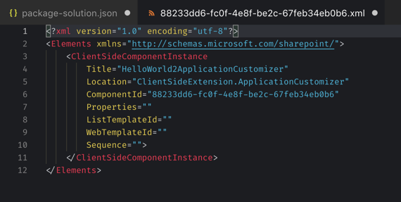
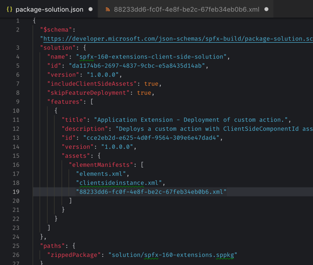

# Rencore tenant-wide SPFx extension deployment information

Easily add tenant-wide deployment information for your SPFx extension directly from Visual Studio Code.

Starting from SharePoint Framework v1.6.0, developers can choose to deploy SharePoint Framework extensions globally across the whole tenant. This is done by including tenant-wide deployment information for each extension in the project. Unfortunately, the SharePoint Framework Yeoman generator only adds this information for the first extension created along with the project. Using the **Rencore tenant-wide SPFx extension deployment information** extension, you can add this information for any extension directly from Visual Studio Code.

1. Right-click on the manifest of the extension, for which you want to add tenant-wide deployment information

2. From the context menu, select the **Add tenant-wide deployment information** option

   

3. The **Rencore tenant-wide SPFx extension deployment information** extension will generate an XML file with the tenant-wide deployment information and register it with the SharePoint Framework solution package.

   

   

## Release Notes

### 1.0.2

Fixed bug in determining the file path of the XML file on Windows.

### 1.0.1

Fixed bug when the manifest file to process isn't open in the editor.

### 1.0.0

Initial release